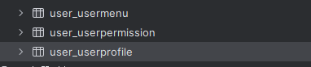
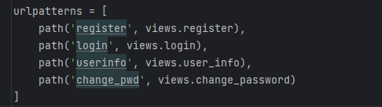

# Django权限管理系统后端模板

## 一、介绍

前端项目链接：`https://github.com/zi-fei-yu-2020/front_system`

这是个vue3+Django的前后端分离项目

## 二、项目介绍

### 1.表结构设计

> 三个表，分别是用户表，权限表，菜单表，这三个表的结构和数据我都放在sql目录下的，大家可以看看

### 2.视图设计

> 只写了四个视图，分别是：
>
> register:注册视图，但是这个视图并没有在前端界面中使用
>
> login:登录视图
>
> userinfo:用户信息视图，主要是传给前端当前用户基本信息和可见路由
>
> change_pwd:修改密码视图

## 三、技术架构

- Django
- simplejwt

## 四、亮点

配合前端实现权限控制，动态路由，每个权限的用户查看到的路由不同

## 五、随便说点

正好想搞这么一个，就搭了这么一个架子，后面的话内容还会继续补充的